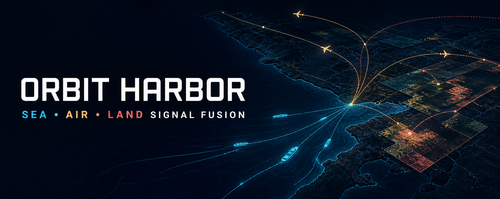
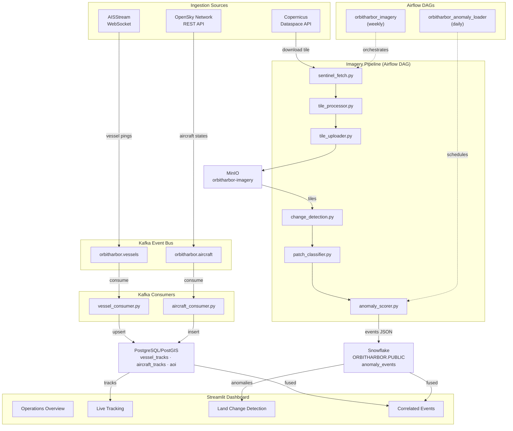

# OrbitHarbor



[](https://www.python.org/downloads/)
[](https://github.com/Arnavsharma2/orbitharbor/actions/workflows/test.yml)

**Sea • Air • Land Signal Fusion**

OrbitHarbor is an open signal-fusion platform for correlating live vessel and aircraft movement with satellite-observed land change. It streams AIS and ADS-B positions through Kafka, stores spatial tracks in PostGIS, processes Sentinel-2 imagery, scores anomalies with PyTorch, warehouses events in Snowflake, and brings the resulting context together in a four-view Streamlit operations console.

---

## Table of Contents

- [Overview](#overview)
- [Architecture](#architecture)
- [Tech Stack](#tech-stack)
- [Features](#features)
- [Performance](#performance)
- [Getting Started](#getting-started)
  - [Prerequisites](#prerequisites)
  - [Environment Setup](#environment-setup)
  - [Running the Pipeline](#running-the-pipeline)
- [Project Structure](#project-structure)
- [Upstream Attribution](#upstream-attribution)

---

## Overview

OrbitHarbor normalizes Class A, Class B, Extended Class B, and OpenSky state-vector messages into a common spatial workflow. Finite WGS84 validation protects the pipeline at ingestion and persistence boundaries, including valid positions on the Equator and prime meridian. Weekly imagery processing and daily anomaly loading are orchestrated with Airflow retries and explicit dependency ordering.

---

## Architecture



---

## Tech Stack

| Layer | Technology |
| ------- | ------------ |
| Language | Python 3.12 |
| Messaging | Apache Kafka |
| Geospatial DB | PostgreSQL, PostGIS |
| Object Storage | MinIO |
| Imagery | GDAL, Rasterio |
| ML | PyTorch |
| Warehouse | Snowflake |
| Dashboard | Streamlit, pydeck |
| Orchestration | Docker Compose, Apache Airflow |
| Infrastructure | Docker Compose |
| Testing | pytest, pytest-cov |
| Environment | Conda |
| Linting | flake8, pylint, black, mypy, yamllint |

---

## Features

- **2-Source Ingestion** - AISStream WebSocket and OpenSky Network REST API publishing live vessel and aircraft positions to Kafka
- **AIS Normalization** - Handles Class A, Class B Standard, and Class B Extended position reports, normalizing MMSI, vessel name, coordinates, speed, heading, course, and navigational status
- **ADS-B Normalization** - Filters airborne-only records and normalizes ICAO24, callsign, origin country, altitude, velocity, heading, and vertical rate
- **PostGIS Spatial Schema** - Three tables with `GEOMETRY(Point/Polygon, 4326)` columns and GIST spatial indexes: `vessel_tracks`, `aircraft_tracks`, and `aoi`
- **Sentinel-2 Fetch** - Authenticates with Copernicus Dataspace, searches for available L2A tiles over the configured AOI, and downloads the most recent tile
- **Tile Processing** - Extracts B04 and B08 spectral bands, reprojects to WGS84, clips to AOI bounding box, and saves as Cloud-Optimized GeoTIFF using GDAL and Rasterio
- **NDVI Change Detection** - Computes NDVI delta between two tile dates and flags 512x512 patches where mean delta exceeds the configured threshold
- **PyTorch Patch Classifier** - Lightweight binary CNN trained on real NDVI delta patches, scoring each anomaly patch with a probability between 0 and 1. Pre-trained weights included
- **Anomaly Scorer** - Combines NDVI delta score and CNN confidence into a single ranked confidence score per patch
- **Snowflake Loader** - Loads scored anomaly events into Snowflake `ORBITHARBOR.PUBLIC.anomaly_events` with duplicate detection and timestamp tracking
- **Airflow Orchestration** - Two DAGs: `orbitharbor_imagery` runs weekly (fetch -> process -> upload -> change detection -> score anomalies) and `orbitharbor_anomaly_loader` runs daily, both with retries and dependency ordering
- **Fully Containerized** - All ingestion services, Airflow, MinIO, PostGIS, Kafka, and the dashboard run via a single `docker compose up`
- **4-View Operations Console** - Operations overview with KPI cards and AOI summary, live vessel and aircraft tracking with loitering detection and speed colour encoding, Sentinel-2 before/after scene previews with patch bounding boxes and quality diagnostics, and correlated-event analysis with a priority-ranked anomaly list
- **Fused Intelligence** - Correlates satellite-detected land-surface change with nearby vessel and aircraft movement in space and time, assigning URGENT/HIGH/MEDIUM/LOW priority by combined confidence score and nearby asset count
- **Loitering Detection** - Identifies vessels with ≥8 pings, avg speed ≤5kn, operating within a 1.5km radius over ≥45 minutes
- **pytest Suite** - Coverage across ingestion normalization, spatial schema, DAG structure, imagery processing, consumers, MinIO, Snowflake loading, and coordinate validation
- **Coordinate Quality Guardrails** - Preserves valid Equator and prime-meridian tracks while rejecting missing, non-finite, and out-of-range WGS84 coordinates before they reach PostGIS

---

## Performance

- Vectorized Haversine distance calculations replace row-by-row pandas callbacks during signal correlation.
- NDVI processing uses float32 arrays, in-place deltas, and vectorized patch aggregation to reduce memory and Python-loop overhead.
- CNN inference runs in bounded batches so throughput scales without stacking every anomaly patch in memory.
- Kafka producers use short batching windows, gzip compression, persistent OpenSky HTTP connections, and quieter per-message logging.
- PostGIS consumers avoid empty transactions, while the Snowflake loader performs one duplicate lookup and one batched insert per event file.
- CI caches Conda packages, Docker excludes runtime and test artifacts from build contexts, and all environments target Python 3.12.

---

## Getting Started

### Prerequisites

- [Docker Desktop](https://www.docker.com/) (16GB RAM recommended)
- [Miniconda](https://docs.conda.io/en/latest/miniconda.html) or Anaconda
- Python 3.12

### Accounts Required

| Service | Purpose | Link |
| --------- | --------- | ------ |
| AISStream | Live vessel WebSocket feed | aisstream.io |
| OpenSky Network | Live aircraft REST API | opensky-network.org |
| Copernicus Dataspace | Sentinel-2 satellite imagery | dataspace.copernicus.eu |
| Snowflake | Anomaly event warehouse | snowflake.com |

### Environment Setup

**1. Clone the repository:**

```bash
git clone https://github.com/Arnavsharma2/orbitharbor.git
cd orbitharbor
```

**2. Configure your environment:**

```bash
cp config/settings_example.yaml config/settings.yaml
# edit settings.yaml with your API keys and credentials
```

**3. Create the local Conda environment (for running tests):**

```bash
conda env create -f environment.yaml
conda activate orbitharbor
```

**4. Start the full pipeline:**

```bash
docker compose -f docker/docker-compose.yaml up
```

This starts all services automatically - Kafka, PostGIS, MinIO, Airflow, all ingestion producers and consumers, and the Streamlit dashboard.

### Running the Pipeline

Once the stack is running, the ingestion services start immediately and begin streaming live vessel and aircraft data. To run the imagery pipeline:

**5. Trigger the imagery pipeline in Airflow:**

Open http://localhost:8080 (admin / admin), enable the `orbitharbor_imagery` DAG, and trigger a manual run. The five-task pipeline fetches a Sentinel-2 tile from Copernicus, processes it into Cloud-Optimized GeoTIFFs, uploads the bands to MinIO, runs NDVI change detection, and scores anomaly patches with the pre-trained CNN. The `orbitharbor_anomaly_loader` DAG then loads scored events into Snowflake on its daily schedule.

| Service | URL | Credentials |
| --- | --- | --- |
| OrbitHarbor Console | http://localhost:8501 | - |
| Airflow UI | http://localhost:8080 | admin / admin |
| MinIO Console | http://localhost:9001 | minioadmin / minioadmin |

**Run tests:**

```bash
pytest
```

**Shut down:**

```bash
docker compose -f docker/docker-compose.yaml down
```

---

## Project Structure

```text
orbitharbor/
|-- .github/
|   |-- workflows/
|       |-- test.yml                    # GitHub Actions test and coverage workflow
|-- docker/                              # Docker Compose stack and Postgres init
│   |-- docker-compose.yaml             # Full pipeline stack - Kafka, PostGIS, MinIO, Airflow, all services
│   |-- postgres/
│       |-- init.sql                    # PostGIS extension and spatial schema on first start
|-- dags/                               # Airflow DAG definitions
|   |-- __init__.py
|   |-- orbitharbor_imagery_dag.py      # Weekly Sentinel fetch, processing, and anomaly scoring
|   |-- orbitharbor_anomaly_dag.py      # Daily scored anomaly event loading to Snowflake
|-- ingestion/                          # AIS and ADS-B data ingestion
│   |-- __init__.py
│   |-- ais_producer.py                 # AISStream WebSocket producer publishing to orbitharbor.vessels
│   |-- adsb_producer.py                # OpenSky REST producer publishing to orbitharbor.aircraft
│   |-- validation.py                   # Shared finite WGS84 coordinate validation
|   |-- consumers/
|       |-- __init__.py
|       |-- vessel_consumer.py          # Consumes orbitharbor.vessels and upserts to PostGIS
|       |-- aircraft_consumer.py        # Consumes orbitharbor.aircraft and inserts to PostGIS
|       |-- lag_monitor.py              # Reports Kafka consumer group lag per partition
|-- imagery/                            # Sentinel-2 imagery pipeline
|   |-- __init__.py
|   |-- minio_setup.py                  # Creates orbitharbor-imagery bucket in MinIO
|   |-- sentinel_fetch.py               # Authenticates with Copernicus and downloads L2A tiles
|   |-- tile_processor.py               # Extracts B04/B08 bands and saves as Cloud-Optimized GeoTIFF
|   |-- tile_uploader.py                # Uploads processed COG tiles to MinIO
|   |-- change_detection.py             # NDVI band-difference change detection between tile dates
|   |-- patch_classifier.py             # PyTorch CNN scoring anomaly patches 0–1
|   |-- anomaly_scorer.py               # Combines NDVI delta and CNN score into ranked confidence
|   |-- weights/
|       |-- patch_classifier.pt         # Pre-trained CNN model weights
|   |-- events/                         # Scored anomaly event outputs
|   |-- downloads/                      # Raw downloaded Sentinel tile zips
|   |-- processed/                      # Processed Cloud-Optimized GeoTIFFs
|-- snowflake_loader/                   # Snowflake schema and event loading
|   |-- __init__.py
|   |-- setup.py                        # Creates ORBITHARBOR.PUBLIC.anomaly_events table
|   |-- anomaly_loader.py               # Loads scored anomaly events into Snowflake with deduplication
|-- dashboard/                          # 4-tab Streamlit intelligence dashboard
|   |-- __init__.py
|   |-- app.py                          # Main dashboard entry point and tab layout
|   |-- components/
|       |-- __init__.py
|       |-- track_map.py                # PostGIS vessel/aircraft fetchers and loitering detection
|       |-- anomaly_feed.py             # Snowflake anomaly event fetchers
|       |-- correlation.py              # Haversine proximity, anomaly centering, priority assignment
|       |-- analyst_summary.py          # Template-based intelligence narrative generator
|       |-- kpi.py                      # KPI cards, AOI summary, and anomaly event cards
|-- tests/                              # pytest test suite
|   |-- __init__.py
|   |-- conftest.py                     # Shared fixtures and test configuration
|   |-- test_ingestion.py               # AIS and ADS-B normalization tests
|   |-- test_spatial.py                 # PostGIS schema and spatial query tests
|   |-- test_dags.py                    # Airflow DAG structure and dependency tests
|   |-- test_imagery.py                 # Sentinel fetch, tile processing, and change detection tests
|   |-- test_consumers.py               # Vessel and aircraft consumer tests
|   |-- test_minio.py                   # MinIO bucket setup and upload tests
|   |-- test_snowflake.py               # Snowflake loader and schema setup tests
|   |-- test_validation.py              # WGS84 coordinate boundary and malformed-input tests
|-- db/
│   |-- schema.sql                      # PostGIS table definitions and GIST index setup
│   |-- queries/                        # Reusable spatial SQL queries
|-- config/
│   |-- __init__.py
│   |-- settings_example.yaml           # Template config with all required fields
│   |-- config_loader.py                # Loads and validates settings.yaml at startup
│   |-- logging_config.py               # Shared logging configuration
|-- docs/                               # OrbitHarbor brand artwork
|-- logs/                               # Runtime log output
|-- Dockerfile                          # Image for ingestion, consumers, and dashboard services
|-- Dockerfile.airflow                  # Custom Airflow image with orbitharbor conda environment
|-- environment.yaml                    # Conda environment spec (local dev and testing)
|-- environment.airflow.yaml            # Conda environment spec for Airflow containers
|-- pytest.ini                          # pytest config with coverage settings
|-- NOTICE                              # Upstream attribution for this derivative work
|-- README.md
```

---

## Upstream Attribution

OrbitHarbor built upon the Apache-2.0-licensed [cristi4nhdz/geospatial-activity-pipeline](https://github.com/cristi4nhdz/geospatial-activity-pipeline) project by [@cristi4nhdz](https://github.com/cristi4nhdz). The upstream [`LICENSE`](LICENSE) is preserved, and [`NOTICE`](NOTICE) records the source and license attribution.
